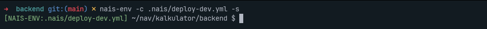

# nais-env

## Om prosjektet

`nais-env` er CLI et verktøy for å hente konfigurasjonsvariabler fra NAIS og gjøre dem tilgjengelige lokalt. Dette forenkler lokal utvikling ved å gi deg muligheten til å jobbe med de samme miljøvariablene som finnes i Kubernetes.


## Funksjonalitet

- Henter miljøvariabler og hemmeligheter fra NAIS-konfigurasjonen
- Kan lagre disse til en fil for senere bruk
- Kan starte et nytt shell med alle miljøvariabler satt
- Mulighet for å skrive ut hemmelighetene direkte (når det er trygt å gjøre det)
- Legger automatisk til genererte filer i `.git/info/exclude` for å unngå at sensitive data sjekkes inn
- Kan rydde opp og slette alle genererte miljøfiler med `--clear-files`
- Setter miljøvariabelen `NAIS_ENV_ACTIVE=true` når shell startes med `--shell`
- Støtter spesifisering av Kubernetes-kontekst (begrenset til 'nais-dev' og 'dev-fss')

## Installasjon

1. Last ned den nyeste versjonen av binærfilen for ditt operativsystem fra [GitHub releases](https://github.com/navikt/nais-env/releases)

2. Gi binærfilen kjøretillatelser:
   ```bash
   chmod +x nais-env
   ```

3. Flytt binærfilen til en mappe som er inkludert i din $PATH:
   ```bash
   # Eksempel med /usr/local/bin (krever sudo)
   sudo mv nais-env /usr/local/bin/
   
   # Alternativt, for bruker-spesifikk installasjon
   mkdir -p $HOME/bin
   mv nais-env $HOME/bin/
   
   # Hvis $HOME/bin ikke allerede er i PATH, legg den til
   echo 'export PATH=$HOME/bin:$PATH' >> ~/.bashrc  # For bash
   # eller
   echo 'export PATH=$HOME/bin:$PATH' >> ~/.zshrc   # For zsh
   ```

4. Verifiser installasjonen:
   ```bash
   nais-env --version
   ```

### Tab-completion

Nais-env støtter tab-completion for bash, zsh, fish og PowerShell. Du kan generere completion-skript ved å bruke følgende kommandoer:

#### Bash

```bash
# Generer og installer completion-skript for gjeldende bruker
nais-env completion bash > ~/.bash_completion

# På noen systemer må du kanskje laste inn skriptet manuelt
echo 'source ~/.bash_completion' >> ~/.bashrc
```

#### Zsh

```zsh
# Opprett completion-katalog hvis den ikke finnes
mkdir -p ~/.zsh/completion

# Generer completion-skript
nais-env completion zsh > ~/.zsh/completion/_nais-env

# Legg til i .zshrc hvis ikke allerede inkludert
echo 'fpath=(~/.zsh/completion $fpath)' >> ~/.zshrc
echo 'autoload -U compinit && compinit' >> ~/.zshrc
```

#### Fish

```fish
# Generer og installer completion-skript
nais-env completion fish > ~/.config/fish/completions/nais-env.fish
```

#### PowerShell

```powershell
# Generer completion-skript
nais-env completion powershell > nais-env.ps1

# Legg til i PowerShell-profilen
echo ". /path/to/nais-env.ps1" >> $PROFILE
```

Shell må restartes for at tab-completion skal fungere

## Bruk

```bash
# Vis hjelp
nais-env --help

# Hent miljøvariabler og lagre til fil
nais-env --config path/to/nais.yaml --file .env

# Bruk Handlebars-variabler for å prosessere nais.yaml
nais-env --config path/to/nais.yaml --variables path/to/vars.yaml --file .env

# Vis prosessert template etter variabelsubstitusjon
nais-env --config path/to/nais.yaml --variables path/to/vars.yaml --print-template

# Start et shell med alle miljøvariablene tilgjengelig
nais-env --config path/to/nais.yaml --shell

# Vis alle miljøvariablene i terminalen
nais-env --config path/to/nais.yaml --print

# Slett alle miljøfiler som er opprettet av nais-env
nais-env --clear-files

# Spesifiser Kubernetes-kontekst (nais-dev eller dev-fss)
nais-env --config path/to/nais.yaml --context dev-fss
```

### Handlebars Template Support

`nais-env` støtter nå Handlebars-template-syntax for dynamisk konfigurasjon. Dette gjør det mulig å bruke en template-fil (`nais.yaml`) sammen med en variabel-fil (`vars.yaml`) for å generere forskjellige miljøkonfigurasjoner.

#### Eksempel på Template (nais.yaml)

```yaml
apiVersion: nais.io/v1alpha1
kind: Application
metadata:
  name: {{ app.name }}
  namespace: {{ app.namespace }}
  labels:
    team: {{ app.team }}
spec:
  image: {{ image }}
  ingresses:
    {{#each app.ingresses as |url|}}
      - {{url}}
    {{/each}}
  env:
    - name: ENV
      value: {{ app.env }}
    - name: API_URL
      value: {{ api.url }}
```

#### Eksempel på Variabel-fil (vars-dev.yaml)

```yaml
app:
  name: 'my-app-dev'
  namespace: 'my-team-dev'
  team: 'my-team'
  ingresses:
    - 'https://my-app.dev.nav.no'
    - 'https://my-app.intern.dev.nav.no'
  env: dev

api:
  url: 'https://api.dev.nav.no'

image: 'ghcr.io/navikt/my-app:latest'
```

#### Støttede Handlebars-features

- **Enkel variabelsubstitusjon**: `{{ variable.path }}`
- **Løkker**: `{{#each array}} ... {{/each}}`
- **Betingelser**: `{{#if condition}} ... {{/if}}`
- **Og andre standard Handlebars-features**

#### Bruk med variabler

```bash
# Prosesser template og hent miljøvariabler fra Kubernetes
nais-env -c nais.yaml -v vars-dev.yaml --print

# Lagre til fil
nais-env -c nais.yaml -v vars-dev.yaml --file .env

# Se den prosesserte templaten
nais-env -c nais.yaml -v vars-dev.yaml --print-template
```

#### Template-prosessering uten Kubernetes

Du kan bruke `--print-template` for å kun prosessere templaten med variabler, uten å koble til Kubernetes. Dette er nyttig for å:
- Verifisere at variabler blir substituert riktig
- Generere fullstendig NAIS-konfigurasjon for manuell inspeksjon
- Bruke som input til andre verktøy

```bash
# Kun prosesser template, ingen Kubernetes-tilkobling nødvendig
nais-env -c nais.yaml -v vars-dev.yaml --print-template > processed-nais.yaml
```

**Merk**: Hvis du ikke bruker `--print-template`, vil verktøyet forsøke å koble til Kubernetes for å hente hemmeligheter og miljøvariabler. Dette krever at du er autentisert mot klusteret.

### Tilpasning av zsh-prompt

For å få en tilpasset prompt i zsh når du bruker `--shell`, kan du legge til følgende i din `.zshrc`:

```zsh
if [[ -n "$NAIS_ENV_ACTIVE" ]]; then
  PROMPT="%F{green}[NAIS-ENV:$NAIS_ENV_CONFIG]%f %~ $ "
fi
```

Dette vil gi deg en tydelig indikasjon når du jobber i et shell med NAIS-miljøvariabler:



## Forutsetninger

- Du må være autentisert mot Kubernetes-klusteret
- nais.yaml-filen må være korrekt konfigurert

## Bidrag

Bidrag er hjertelig velkommen! Vennligst send inn en pull request eller opprett et issue hvis du har forslag til forbedringer.
